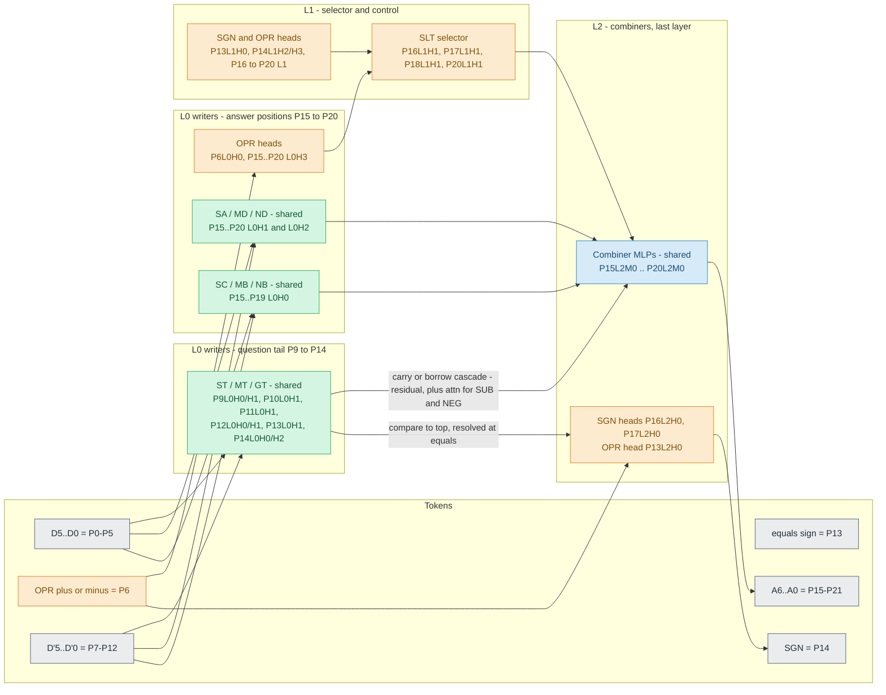

# Mixed model mechanism diagrams (`ins1_mix_d6_l3_h4_t40K_s372001`)

**Scope: MIXED model only** (6-digit add/sub, 3 layers, 4 heads; initialised from a
6-digit addition model). Agent-created synthesis of the `maths` mixed thread's
findings; complements the human-owned [mixed_model.md](mixed_model.md) with two
diagrams. Sources: the verified HF map (`*_maths.json` / `*_behavior.json`, captured
in `results/study-mixed-map/`) and claims **CE20–CE23, CE25**
([maths-claim-evidence.md](maths-claim-evidence.md)). Do not read these as addition
claims — the addition mechanism is CE1–CE19.

> **This is the hand-annotated exemplar** (prose + CE-evidence interpretation). The
> **structural diagrams + text chunks are now generated by the library** so they can
> be produced for the ~40-model zoo: `quanta_maths.build_mechanism_markdown(model)`
> (module `maths_diagram.py`) emits both Mermaid diagrams, the token layout, the
> exact node inventory, and auto-detected node-sharing from any model's verified
> map. Batch driver: `scripts/gen_mechanism_docs.py` → `docs/generated/<model>_mechanism.md`
> (this model's generated doc:
> [generated/ins1_mix_d6_l3_h4_t40K_s372001_mechanism.md](generated/ins1_mix_d6_l3_h4_t40K_s372001_mechanism.md)).

Legend for both diagrams:

- **green = SHARED** across ADD / SUB / NEG (one set of nodes computes all three
  candidate answers)
- **orange = CONTROL / SELECTION** (operator `OPR`, sign `SGN`, selector `SLT`)
- **blue = COMBINER** (the shared last-layer answer MLP)
- **grey = tokens / outputs**

---

## 1. Logical mechanism (no token positions)

How the components interact and which are shared between addition and subtraction.
Per digit, one shared "engine" computes the add / positive-sub / negative-sub
candidates; the operator + sign select which one the shared combiner emits.

```mermaid
flowchart TD
  IN["Operand digit pair Dn and D'n"]:::inp
  OPR(["OPR: plus or minus - operator"]):::ctrl

  subgraph ENG["Per-digit engine - SHARED by ADD, SUB, NEG - one node set - CE20"]
    direction TB
    BASE["Base digit&#160;&#160;SA / MD / ND<br/>sum mod10, or Dn-D'n mod10, or D'n-Dn mod10"]:::shared
    CB["Carry or Borrow-one&#160;&#160;SC / MB / NB"]:::shared
    TRI["TriCase and Compare&#160;&#160;ST / MT / GT<br/>class no / yes / U, and Dn vs D'n"]:::shared
  end
  IN --> BASE
  IN --> CB
  IN --> TRI

  RES["Cascade resolver&#160;&#160;SV / MV / NV<br/>tri-state chain to binary carry or borrow<br/>STEP-thresholded - CE22"]:::shared
  TRI --> RES
  CB --> RES

  SGN(["SGN: answer sign<br/>plus if OPR is plus, else plus if D ge D' else minus - CE21"]):::ctrl
  OPR --> SGN
  TRI -->|"compare cascade to the top, at ="| SGN

  SEL(["SLT selector: choose S / M / N<br/>distributed, not a low-rank switch - CE23"]):::ctrl
  OPR --> SEL
  SGN --> SEL

  COMB["Combiner per answer digit - SHARED - CE22, CE23<br/>STEP: base plus carry, or base minus borrow, mod 10"]:::comb
  BASE --> COMB
  RES -->|"delivered: ADD via residual; SUB and NEG via residual plus attention - CE25"| COMB
  SEL --> COMB

  COMB --> AN(["Answer digit An"]):::out
  SGN --> ASGN(["Answer sign - leading answer token"]):::out

  classDef inp fill:#ffffff,stroke:#333333,color:#111111;
  classDef shared fill:#d5f5e3,stroke:#27ae60,color:#145a32;
  classDef ctrl fill:#fdebd0,stroke:#e67e22,color:#7e5109;
  classDef comb fill:#d6eaf8,stroke:#2e86c1,color:#1b4f72;
  classDef out fill:#eaecee,stroke:#566573,color:#212f3d;
```

**What is shared vs separate (logical):**

| Component | Shared across classes? | Evidence |
| --- | --- | --- |
| Base digit `SA`/`MD`/`ND` | **Shared nodes** (one head computes all 3 candidates) | map (same nodes); CE21 (readouts overlap; add rotated from sub) |
| Carry/Borrow-one `SC`/`MB`/`NB` | **Shared nodes** | map (same nodes) |
| TriCase / Compare `ST`/`MT`/`GT` | **Shared nodes** | map (same nodes) |
| Cascade resolver `SV`/`MV`/`NV` | **Shared mechanism**, STEP combiner | CE22 (STEP, all classes); CE20 (binary resolved code) |
| Combiner (answer MLP) | **Shared** (emits correct digit for whichever op the L1 state encodes) | CE22, CE23 |
| `OPR` operator | control signal, broadcast everywhere; consumed upstream | CE21, CE23 |
| `SGN` sign | control; = the D-vs-D' comparison resolved at `=` | CE21 |
| `SLT` selector | selection; **distributed / high-dimensional, not a rank-1 knob** | CE23 |
| Delivery route of the resolved cascade | **differs by class**: ADD residual-only; SUB/NEG residual + last-layer attention | CE25 |

---

## 2. Actual implementation (with token positions)

Token layout (6-digit): `D5..D0` = P0-P5, **`OPR` = P6**, `D'5..D'0` = P7-P12,
**`=` = P13**, **`SGN` = P14**, `A6..A0` = P15-P21. Layers L0/L1/**L2**; combiner =
L2 answer MLP. Data flows left-to-right through the layers; the same shaded roles as
Diagram 1.

### Worked example — answer digit `A2` (produced at token **P18**)

Mirrors the [mixed_model.md](mixed_model.md) A2 walkthrough, annotated with roles:

- `P18L0H1`, `P18L0H2` — **SA/MD/ND** (base digit; shared, 3 candidates)
- `P18L0H0` — **SC/MB/NB** (carry/borrow-one into this digit; shared)
- `P18L0H3` — **OPR** (operator read)
- `P18L1H1` — **SLT** (selector: pick S/M/N) · `P18L1H2` OPR · `P18L1H3` SGN
- `P18L2M0` — **combiner** (STEP: base ± resolved carry/borrow → A2)
- carry/borrow into P18 arrives from the question-tail `ST/MT/GT` writers
  (P9-P14) — via the residual for ADD, residual + last-layer attention for SUB/NEG.

### Exact node inventory (from the verified map)

| Role | Task(s) | Nodes (`PnLnHn` / `PnLnMn`) |
| --- | --- | --- |
| Question-tail TriCase/Compare (shared) | ST, MT, GT | ST: P9L0H1,P10L0H1,P11L0H1,P12L0H1,P13L0H1,P14L0H0,P14L0H2 · MT: P9L0H0,P10L0H1,P11L0H1,P12L0H0,P13L0H1,P14L0H0 · GT: P9L0H0,P10L0H1,P11L0H1,P12L0H1,P13L0H1 |
| Base digit (shared) | SA, MD, ND | SA & MD: P15-P20 L0H1 and L0H2 · ND: P16-P20 L0H1 and L0H2 |
| Carry/Borrow-one (shared) | SC, MB, NB | SC: P15-P19 L0H0 · MB: P18,P19 L0H0 · NB: P17,P18,P19 L0H0 |
| Operator (control) | OPR | P6L0H0 + P10/P12-P20 (L0H3 mainly), P13L1H0, P13L2H0, P17L1H2, P18L1H2 |
| Sign (control) | SGN | P14 (L0H2, L1H2/H3), P15-P20 (L0H3), P16L1H0, P16L2H0, P17L2H0, P20L1H0 |
| Selector (control) | SLT | P16L1H1, P17L1H1, P18L1H1, P20L1H1 |
| Combiner (shared) | STC/MTC/NTC (answer MLP) | P15L2M0, P16L2M0, P17L2M0, P18L2M0, P19L2M0, P20L2M0 |

Notes: `SA` and `MD` occupy the **same 12 nodes** (polysemantic); `ND` the same
H1/H2 heads from P16 up. `ST`/`MT`/`GT` share P10L0H1, P11L0H1, P13L0H1. The map
tags no `NT`/combiner (STC/MTC/NTC) roles — the combiner nodes are the high-`Fail%`
L2 answer MLPs, confirmed causal here (CE22). Verdicts (STEP combiner; canonical
message; delivery route; shared-engine-but-distributed-selection) are single-model;
the reusable sweep in `quanta_maths/maths_cascade.py` runs them across the zoo.
