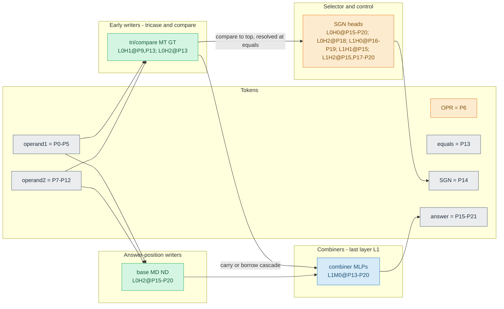

# Auto-generated mechanism doc — `sub_d6_l2_h3_t30K_s372001`

**Generated by `quanta_maths.maths_diagram.build_mechanism_markdown` from the
model's maximal map JSON** (`results/maps/sub_d6_l2_h3_t30K_s372001.json`). Model type:
SUB, NEG. Config: n_digits=6, n_layers=2, n_heads=3,
n_ctx=22.

This doc is **structural** (map-derived). Interpretation and causal verdicts live
in the study notes and [claim-evidence](../../docs/maths-claim-evidence.md).
Per-task algorithmic meanings (`SA`/`MD`/`ND`, `ST`/`MT`/`NT`/`GT`,
`SC`/`MB`/`NB`, `OPR`/`SGN`/`SLT`, `STC`/`MTC`/`NTC`) are defined in the
[glossary](../../docs/thor-glossary.md#project-terms). To regenerate, see
[docs/mixed_model_mechanism.md](../../docs/mixed_model_mechanism.md).

Legend: **green = shared** across operations (one node set), **orange =
control/selection** (OPR/SGN/SLT), **blue = combiner** (last-layer answer MLP),
**grey = tokens/outputs**.

## 1. Logical mechanism (no token positions)

```mermaid
flowchart TD
  IN["Operand digit pair Dn and D'n"]:::inp
  subgraph ENG["Per-digit engine - SHARED by SUB, NEG - one node set"]
    direction TB
    BASE["Base digit&#160;&#160;MD / ND"]:::shared
    CB["Carry or Borrow-one&#160;&#160;carry"]:::shared
    TRI["TriCase and Compare&#160;&#160;MT / GT"]:::shared
  end
  IN --> BASE
  IN --> CB
  IN --> TRI
  RES["Cascade resolver&#160;&#160;binary carry or borrow<br/>STEP-thresholded combiner input"]:::shared
  TRI --> RES
  CB --> RES
  SGN(["SGN: answer sign<br/>plus if add, else plus if D ge D' else minus"]):::ctrl
  TRI -->|compare cascade to the top| SGN
  COMB["Combiner per answer digit - SHARED<br/>STEP: base plus carry, or base minus borrow, mod 10"]:::comb
  BASE --> COMB
  RES --> COMB
  COMB --> AN(["Answer digit An"]):::out
  SGN --> ASGN(["Answer sign - leading answer token"]):::out
  classDef shared fill:#d5f5e3,stroke:#27ae60,color:#145a32;
  classDef ctrl fill:#fdebd0,stroke:#e67e22,color:#7e5109;
  classDef comb fill:#d6eaf8,stroke:#2e86c1,color:#1b4f72;
  classDef out fill:#eaecee,stroke:#566573,color:#212f3d;
  classDef inp fill:#ffffff,stroke:#333333,color:#111111;
```

## 2. Actual implementation (with token positions)

Token layout:

| Tokens | Positions |
| --- | --- |
| D5..D0 (operand 1) | P0-P5 |
| OPR (operator + or -) | P6 |
| D'5..D'0 (operand 2) | P7-P12 |
| = (equals) | P13 |
| SGN (answer sign) | P14 |
| A6..A0 (answer digits) | P15-P21 |

### Exact node inventory (from the verified map)

Task-code meanings: see the [glossary](../../docs/thor-glossary.md#project-terms).

| Task | Nodes |
| --- | --- |
| `MT` | P9L0H1, P13L0H1, P13L0H2 |
| `GT` | P9L0H1, P13L0H1, P13L0H2 |
| `MD` | P15L0H2, P16L0H2, P17L0H2, P18L0H2, P19L0H2, P20L0H2 |
| `ND` | P16L0H2, P17L0H2, P18L0H2, P19L0H2, P20L0H2 |
| `SGN` | P15L0H0, P16L0H0, P17L0H0, P18L0H0, P19L0H0, P20L0H0, P18L0H2, P16L1H0, P17L1H0, P18L1H0, P19L1H0, P15L1H1, P15L1H2, P17L1H2, P18L1H2, P19L1H2, P20L1H2 |
| `MTC` (combiner tag) | P16L1M0, P17L1M0, P18L1M0, P20L1M0 |
| `NTC` (combiner tag) | P16L1M0, P17L1M0, P18L1M0, P19L1M0, P20L1M0 |
| combiner (last-layer answer MLP) | P13L1M0, P14L1M0, P15L1M0, P16L1M0, P17L1M0, P18L1M0, P19L1M0, P20L1M0 |

### Node sharing detected in the map (polysemantic nodes)

- `MD` and `ND` share **5** node(s)
- `MTC` and `NTC` share **4** node(s)
- `GT` and `MT` share **3** node(s)
- `MD` and `SGN` share **1** node(s)
- `ND` and `SGN` share **1** node(s)
