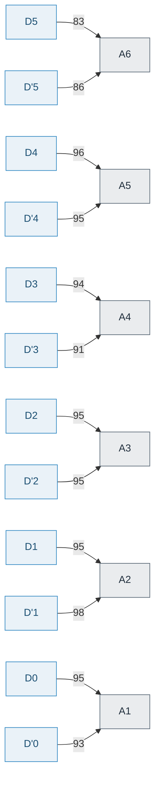
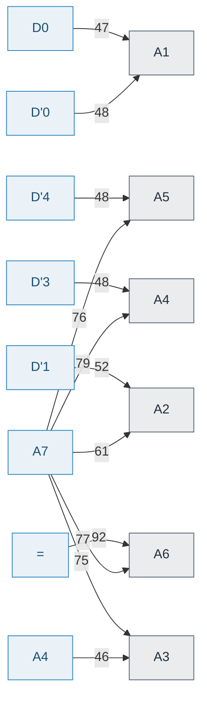
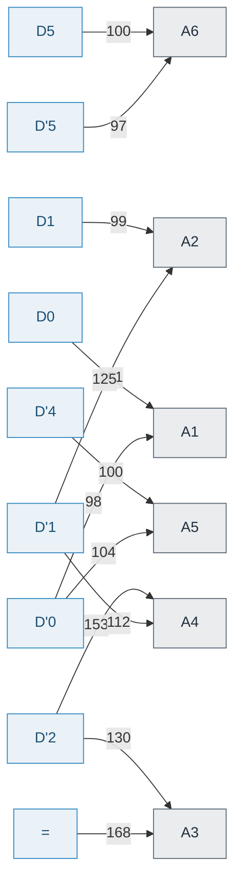
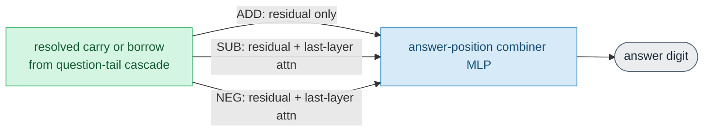

# Candidate node-fact visualizations - scored report

Ten candidate visualizations for the auto-generated per-model HF doc, each **combining several fact types in one view** to expose the linkage between a node's importance, role, output digits, routing and delivery. Built by `quanta_maths.maths_viz` from the full `behaviors.json` + `features.json` (all node facts: `Fail%`, `Impact`, `Attn`, `Math.Add/Sub/Neg`, `Algo` roles, `Probe:{LINXFER,CARRYLAYER,CARRYDEFER,DELIVERY}`). Regenerate: `PYTHONPATH=. python scripts/gen_visualizations.py`.

**Models** (all 6-digit, accurate, identical token layout for comparison):

- addition: `add_d6_l2_h3_t20K_s572091`
- subtraction: `sub_d6_l2_h3_t30K_s372001`
- mixed: `ins1_mix_d6_l3_h4_t40K_s372001`

**Usefulness scale**: 5 = adopt as a default panel; 4 = adopt; 3 = situational; 2 = optional/appendix; 1 = drop. Scores are the author's judgement; diagrams are auto-rendered.

## Scoring summary

| ID | Visualization | Facts linked | Score | Verdict |
|---|---|---|---|---|
| V1 | Enriched node-map grid | location + role + Fail% + node-type | **5.0** | Adopt as the headline map in the per-model HF doc. |
| V2 | Role x answer-digit impact matrix | role + Impact-digit + Fail% + redundancy | **4.5** | Adopt; strong companion to V1. |
| V3 | Attention fetch/routing flow | attention + position-semantics + role | **4.0** | Adopt for small/mid models; cap edges for large ones. |
| V4 | Per-digit compute pipeline | role-chain + Impact-digit + delivery route + location | **4.0** | Adopt as an illustrative inset, not the main map. |
| V5 | Layer-phase profile | layer + role-group + Fail% + phase | **4.5** | Adopt as the doc's opening summary. |
| V6 | Polysemantic role-sharing matrix | role co-location (shared engine) | **4.0** | Adopt for mixed/sub; suppress for pure addition. |
| V7 | Delivery-route-by-class | delivery route + question class + combiner | **3.5** | Include for mixed models; skip when no DELIVERY tags. |
| V8 | Redundancy & importance spectrum | role + node-count + Fail% distribution | **4.0** | Adopt; cheap and evidentially on-message. |
| V9 | Operand decodability (LINXFER) map | Probe geometry + fetch location + operand digit | **2.5** | Keep as an optional appendix row; low priority. |
| V10 | Operation-class capacity map | Math.* op-class + Impact-digit + Fail% | **4.0** | Adopt for mixed; informative but secondary for single-op. |

Mean usefulness across the ten: **4.0/5**.


---

## V1. Enriched node-map grid  (score 5.0/5)

*Facts linked: location + role + Fail% + node-type.*


### V1 - addition (`add_d6_l2_h3_t20K_s572091`)

Cell = `Fail% shade` + role(s). Shade: `·`<5 `░`<20 `▒`<50 `▓`<80 `█`>=80. Lanes are `L{layer}{H head|M mlp}{num}`.

| Lane | P10<br>D'2 | P11<br>D'1 | P12<br>D'0 | P14<br>A7 | P15<br>A6 | P16<br>A5 | P17<br>A4 | P18<br>A3 | P19<br>A2 | P20<br>A1 |
|---|---|---|---|---|---|---|---|---|---|---|
| **L0H0** | · ST | ░ ST | ░ ST | · ST | ▒ SC | ▒ SC | ▒ SC |   · | ▒ SC |  |
| **L0H1** |  |  | ░ ST |  | ▒ SA | ░ SA | ░ SA | ░ SA | ░ SA | ░ SA |
| **L0H2** |  |  |  | ▒ ST | ▒ SA | ▒ SA | ▒ SA | ▒ SA | ▒ SA | ▓ SA |
| **L0M0** | · · | ░ · | ▒ · | ▒ · | ▒ · | ▓ · | ▓ · | ▓ · | ▓ · | ▓ · |
| **L1H0** |  |  |  |   · | · · | · · |  |  |  |  |
| **L1H1** |  |  |  | · · | ░ · | ░ · | · · | · · | · · |  |
| **L1H2** |  |  |  |   · |   · |  |  |  |  |  |
| **L1M0** |  |  |  | · · | ▒ · | ▒ · | ▒ · | ▒ · | ▒ · | ▒ · |


### V1 - subtraction (`sub_d6_l2_h3_t30K_s372001`)

Cell = `Fail% shade` + role(s). Shade: `·`<5 `░`<20 `▒`<50 `▓`<80 `█`>=80. Lanes are `L{layer}{H head|M mlp}{num}`.

| Lane | P8<br>D'4 | P9<br>D'3 | P10<br>D'2 | P11<br>D'1 | P12<br>D'0 | P13<br>= | P14<br>A7 | P15<br>A6 | P16<br>A5 | P17<br>A4 | P18<br>A3 | P19<br>A2 | P20<br>A1 |
|---|---|---|---|---|---|---|---|---|---|---|---|---|---|
| **L0H0** | · · | · · |  |  | · · | ▒ · |  | ░ SGN | ░ SGN | ░ SGN | ░ SGN | · SGN | · SGN |
| **L0H1** |  | ░ MT/GT | · · | ░ · | · · | ▒ MT/GT | ▓ · |  |  |  |  |  |  |
| **L0H2** |  | · · |  |  | · · | ▒ MT/GT |  | █ MD | █ MD/ND | █ MD/ND | █ MD/ND/SGN | █ MD/ND | █ MD/ND |
| **L0M0** | · · | · · | · · | · · | · · | ▒ · | ▒ · | █ · | █ · | █ · | █ · | █ · | █ · |
| **L1H0** |  |  |  |  |  |  |  | ▒ · | ░ SGN | · SGN | ▒ SGN | ▒ SGN |  |
| **L1H1** |  |  |  |  |  | ░ · |  | ░ SGN |   · |  |  |  |  |
| **L1H2** |  |  |  |  |  | ░ · |  | · SGN | ▒ · | ▒ SGN | ▒ SGN | ▒ SGN | ▒ SGN |
| **L1M0** |  |  |  |  |  | ░ · | · · | ▓ · | ▓ MTC/NTC | ▓ MTC/NTC | ▓ MTC/NTC | ▓ NTC | ▓ MTC/NTC |


### V1 - mixed (`ins1_mix_d6_l3_h4_t40K_s372001`)

Cell = `Fail% shade` + role(s). Shade: `·`<5 `░`<20 `▒`<50 `▓`<80 `█`>=80. Lanes are `L{layer}{H head|M mlp}{num}`.

| Lane | P0<br>D5 | P6<br>OP | P9<br>D'3 | P10<br>D'2 | P11<br>D'1 | P12<br>D'0 | P13<br>= | P14<br>A7 | P15<br>A6 | P16<br>A5 | P17<br>A4 | P18<br>A3 | P19<br>A2 | P20<br>A1 |
|---|---|---|---|---|---|---|---|---|---|---|---|---|---|---|
| **L0H0** |  | · OPR | · MT/GT | · · | · · | ░ MT | ░ · | ░ ST/MT/OPR | ░ SC | · SC | · SC/NB | ░ SC/MB/NB | ░ SC/MB/NB | · OPR/SGN |
| **L0H1** |  |  | · ST | ░ ST/MT/GT | ░ ST/MT/GT | · ST/GT | ░ ST/MT/GT | · OPR | ▒ SA/MD | ▓ SA/MD/ND | ▒ SA/MD/ND | ▒ SA/MD/ND | ▒ SA/MD/ND | ▓ SA/MD/ND |
| **L0H2** |  |  |  |  |  |  |  | ░ ST/OPR/SGN | ▓ SA/MD/ND | ▓ SA/MD/ND | ▓ SA/MD/ND | ▓ SA/MD/ND | ▓ SA/MD/ND | ▓ SA/MD/ND |
| **L0H3** | ░ · |  |  | · OPR |  | · OPR | ░ OPR |  | · OPR/SGN | ░ OPR/SGN | ░ OPR/SGN | ░ OPR/SGN | ░ OPR/SGN | ░ OPR/SGN |
| **L0M0** |  |  | ░ · | ░ · | ░ · | ░ · | ░ · | ▒ · | ▒ · | ▓ · | ▒ · | ▓ · | ▓ · | ▓ · |
| **L1H0** |  |  |  |  |  |  | · OPR |  |  | · SGN | · · | · · | · · | · SGN |
| **L1H1** |  |  |  |  |  |  |  |  | · · | · SLT | · SLT | · SLT | · · | · SLT |
| **L1H2** |  |  |  |  |  | · · |  | · SGN | · · | ░ · | ░ OPR | ░ OPR |  |  |
| **L1H3** |  |  |  |  |  |  | ░ · | · SGN | ░ · | ░ · | · SGN | · SGN |  |  |
| **L1M0** |  |  |  |  |  | · · |  | · · | ░ · | ▒ · | ▒ · | ▒ · | ▒ · | ▒ · |
| **L2H0** |  |  |  |  |  |  | · OPR |  |  | · SGN | · SGN |  |   · |  |
| **L2H1** |  |  |  |  |  |  |  |  |  |  |  |  |   · |  |
| **L2H2** |  |  |  |  |  |  | · · |  |  |  |  |  |  |  |
| **L2M0** |  |  |  |  |  |  |  |  | · MTC/NTC | · NTC | ░ NTC | ░ NTC | · MTC/NTC | · · |


**Pros**
- Single densest view: every useful node with its role(s) and ablation importance on the real position x layer grid -- a strict upgrade of the paper's per-node subtask table (Tab. MathsPurposePerNode) with Fail% shading fused in.
- Token semantics (D/OP/=/A) in the header make the geography readable.
- Model-agnostic; scales to any size/op.

**Cons**
- Wide for large-digit models (many columns).
- Fail% shade is 5-bucket, not exact; polysemantic cells get long.

**Verdict:** Adopt as the headline map in the per-model HF doc.


---

## V2. Role x answer-digit impact matrix  (score 4.5/5)

*Facts linked: role + Impact-digit + Fail% + redundancy.*


### V2 - addition (`add_d6_l2_h3_t20K_s572091`)

Cell = `Fail% shade`+`# nodes` with that role whose ablation breaks that answer digit. Links **role -> output digit -> importance -> redundancy** in one grid.

| Role | A6 | A5 | A4 | A3 | A2 | A1 | A0 | sign |
|---|---|---|---|---|---|---|---|---|
| `SA` |  | ▒2 | ▒2 | ▒2 | ▒2 | ▒2 | ▓2 |  |
| `SC` |  | ▒1 | ▒1 | ▒1 |  | ▒1 |  |  |
| `ST` | ▒5 | ░4 | ░3 | ░2 | ░1 | ░1 |  |  |


### V2 - subtraction (`sub_d6_l2_h3_t30K_s372001`)

Cell = `Fail% shade`+`# nodes` with that role whose ablation breaks that answer digit. Links **role -> output digit -> importance -> redundancy** in one grid.

| Role | A6 | A5 | A4 | A3 | A2 | A1 | A0 | sign |
|---|---|---|---|---|---|---|---|---|
| `MD` |  | █1 | █2 | █2 | █2 | █2 | █2 |  |
| `ND` |  |  | █1 | █2 | █2 | █2 | █2 |  |
| `MT` |  | ▒3 | ░1 |  |  |  |  | ▒3 |
| `GT` |  | ▒3 | ░1 |  |  |  |  | ▒3 |
| `SGN` |  | ░3 | ░2 | ▒3 | █4 | █4 | ▒2 |  |
| `MTC` |  |  | ▓1 | ▓1 | ▓1 |  | ▓1 |  |
| `NTC` |  |  | ▓1 | ▓1 | ▓1 | ▓1 | ▓1 |  |


### V2 - mixed (`ins1_mix_d6_l3_h4_t40K_s372001`)

Cell = `Fail% shade`+`# nodes` with that role whose ablation breaks that answer digit. Links **role -> output digit -> importance -> redundancy** in one grid.

| Role | A6 | A5 | A4 | A3 | A2 | A1 | A0 | sign |
|---|---|---|---|---|---|---|---|---|
| `SA` |  | ▓2 | ▓2 | ▓2 | ▓2 | ▓2 | ▓2 |  |
| `MD` |  | ▓2 | ▓2 | ▓2 | ▓2 | ▓2 | ▓2 |  |
| `ND` |  | ▓1 | ▓2 | ▓2 | ▓2 | ▓2 | ▓2 |  |
| `SC` |  | ░1 | ·1 | ·1 | ░1 | ░1 |  |  |
| `MB` |  |  |  |  | ░1 | ░1 |  |  |
| `NB` |  |  |  | ·1 | ░1 | ░1 |  |  |
| `ST` | ░7 | ░6 | ░5 | ░4 | ░3 | ░2 | ░1 | ░3 |
| `MT` | ░6 | ░6 | ░5 | ░4 | ░3 | ░2 | ░1 | ░5 |
| `GT` | ░5 | ░5 | ░4 | ░3 | ░2 | ░1 |  | ░4 |
| `OPR` | ░3 | ░2 | ░5 | ░5 | ░5 | ░4 | ░5 | ░5 |
| `SGN` | ░3 | ·1 | ░3 | ░3 | ░2 | ░1 | ░3 |  |
| `SLT` |  |  | ·1 | ·1 | ·1 |  | ·1 |  |
| `MTC` |  | ·1 |  |  |  | ·1 |  |  |
| `NTC` |  | ·1 | ·1 | ░1 | ░1 | ·1 |  |  |


**Pros**
- Links role -> which answer digits it supports -> importance -> redundancy (node count) in one compact matrix.
- Immediately shows the 'each digit served by ~2 base nodes' redundancy and the question-tail ST/MT fan-out across all digits.

**Cons**
- Aggregates away node identity (pair with V1).
- Sign column can be sparse.

**Verdict:** Adopt; strong companion to V1.


---

## V3. Attention fetch/routing flow  (score 4.0/5)

*Facts linked: attention + position-semantics + role.*


### V3 - addition (`add_d6_l2_h3_t20K_s572091`)

Edges = summed attention % from an input token to an answer-position node (top-2 per answer digit); `*` marks an operand-matched fetch. Shows each answer digit **fetching its two operands** `Dk`,`D'k` (+ carry tail).




### V3 - subtraction (`sub_d6_l2_h3_t30K_s372001`)

Edges = summed attention % from an input token to an answer-position node (top-2 per answer digit); `*` marks an operand-matched fetch. Shows each answer digit **fetching its two operands** `Dk`,`D'k` (+ carry tail).




### V3 - mixed (`ins1_mix_d6_l3_h4_t40K_s372001`)

Edges = summed attention % from an input token to an answer-position node (top-2 per answer digit); `*` marks an operand-matched fetch. Shows each answer digit **fetching its two operands** `Dk`,`D'k` (+ carry tail).




**Pros**
- Makes the 'each answer digit fetches its own two operands' routing explicit -- the attention story the paper describes in prose.
- Operand-matched fetches are starred, so the diagonal fetch pattern pops.

**Cons**
- Busy for wide models even at top-2 edges/answer.
- Aggregates multiple heads per answer position.

**Verdict:** Adopt for small/mid models; cap edges for large ones.


---

## V4. Per-digit compute pipeline  (score 4.0/5)

*Facts linked: role-chain + Impact-digit + delivery route + location.*


### V4 - addition (`add_d6_l2_h3_t20K_s572091`)

Causal chain for the best-covered answer digit **A5**, with the actual node locs at each stage and the per-class **delivery route** on the resolve->combiner edge.

```mermaid
flowchart LR
  DK["operands D5, D'5"]:::inp
  BASE["base digit A5<br/>P15L0H1, P15L0H2"]:::shared
  TRI["tri-state and compare, question tail<br/>P10L0H0, P11L0H0, P12L0H0, P12L0H1, P14L0H0, P14L0H2"]:::shared
  CB["carry or borrow into A5<br/>P15L0H0"]:::shared
  RES["resolve cascade to binary carry or borrow"]:::shared
  COMB["combiner for A5<br/>P15L1M0"]:::comb
  AN(["answer digit A5"]):::out
  DK --> BASE
  DK --> CB
  TRI --> RES
  CB --> RES
  BASE --> COMB
  RES -->|"delivery ADD:att"| COMB
  COMB --> AN
  classDef shared fill:#d5f5e3,stroke:#27ae60,color:#145a32;
  classDef comb fill:#d6eaf8,stroke:#2e86c1,color:#1b4f72;
  classDef inp fill:#ffffff,stroke:#333;color:#111;
  classDef out fill:#eaecee,stroke:#566573,color:#212f3d;
```


### V4 - subtraction (`sub_d6_l2_h3_t30K_s372001`)

Causal chain for the best-covered answer digit **A4**, with the actual node locs at each stage and the per-class **delivery route** on the resolve->combiner edge.

```mermaid
flowchart LR
  DK["operands D4, D'4"]:::inp
  BASE["base digit A4<br/>P15L0H2, P16L0H2"]:::shared
  TRI["tri-state and compare, question tail<br/>P13L0H1, P13L0H2, P9L0H1"]:::shared
  CB["carry or borrow into A4<br/>none"]:::shared
  RES["resolve cascade to binary carry or borrow"]:::shared
  COMB["combiner for A4<br/>P16L1M0"]:::comb
  AN(["answer digit A4"]):::out
  DK --> BASE
  DK --> CB
  TRI --> RES
  CB --> RES
  BASE --> COMB
  RES -->|"delivery NEG:resatt, SUB:resatt"| COMB
  COMB --> AN
  classDef shared fill:#d5f5e3,stroke:#27ae60,color:#145a32;
  classDef comb fill:#d6eaf8,stroke:#2e86c1,color:#1b4f72;
  classDef inp fill:#ffffff,stroke:#333;color:#111;
  classDef out fill:#eaecee,stroke:#566573,color:#212f3d;
```


### V4 - mixed (`ins1_mix_d6_l3_h4_t40K_s372001`)

Causal chain for the best-covered answer digit **A5**, with the actual node locs at each stage and the per-class **delivery route** on the resolve->combiner edge.

```mermaid
flowchart LR
  DK["operands D5, D'5"]:::inp
  BASE["base digit A5<br/>P15L0H1, P15L0H2"]:::shared
  TRI["tri-state and compare, question tail<br/>P10L0H1, P11L0H1, P12L0H0, P12L0H1, P13L0H1, P14L0H0, P14L0H2, P9L0H0, P9L0H1"]:::shared
  CB["carry or borrow into A5<br/>P15L0H0"]:::shared
  RES["resolve cascade to binary carry or borrow"]:::shared
  COMB["combiner for A5<br/>P15L2M0"]:::comb
  AN(["answer digit A5"]):::out
  DK --> BASE
  DK --> CB
  TRI --> RES
  CB --> RES
  BASE --> COMB
  RES -->|"delivery ADD:res, NEG:resatt, SUB:resatt"| COMB
  COMB --> AN
  classDef shared fill:#d5f5e3,stroke:#27ae60,color:#145a32;
  classDef comb fill:#d6eaf8,stroke:#2e86c1,color:#1b4f72;
  classDef inp fill:#ffffff,stroke:#333;color:#111;
  classDef out fill:#eaecee,stroke:#566573,color:#212f3d;
```


**Pros**
- Concrete causal chain for one answer digit with the actual node locs at each stage AND the delivery route -- bridges the map to the algorithm.
- Directly mirrors the paper's Hypothesis-3 pseudo-code as a picture.

**Cons**
- One digit at a time; picking the 'best-covered' digit hides per-digit variation.
- The resolver/SV stage is schematic (SV rarely tagged in the map).

**Verdict:** Adopt as an illustrative inset, not the main map.


---

## V5. Layer-phase profile  (score 4.5/5)

*Facts linked: layer + role-group + Fail% + phase.*


### V5 - addition (`add_d6_l2_h3_t20K_s572091`)

Per layer: node counts, which **role groups** live there, the Fail% importance, and the algorithm **phase** -- the pipeline depth at a glance.

| Layer | Heads | MLPs | Role groups (n) | mean/max Fail% | Phase |
|---|---|---|---|---|---|
| L0 | 23 | 10 | base:12, carry:4, tri:6 | 30/74 | fetch + per-digit compute |
| L1 | 11 | 7 | - | 16/40 | combine + emit |


### V5 - subtraction (`sub_d6_l2_h3_t30K_s372001`)

Per layer: node counts, which **role groups** live there, the Fail% importance, and the algorithm **phase** -- the pipeline depth at a glance.

| Layer | Heads | MLPs | Role groups (n) | mean/max Fail% | Phase |
|---|---|---|---|---|---|
| L0 | 25 | 13 | base:11, tri:6, ctrl:7 | 36/92 | fetch + per-digit compute |
| L1 | 15 | 8 | ctrl:10, comb:9 | 32/78 | combine + emit |


### V5 - mixed (`ins1_mix_d6_l3_h4_t40K_s372001`)

Per layer: node counts, which **role groups** live there, the Fail% importance, and the algorithm **phase** -- the pipeline depth at a glance.

| Layer | Heads | MLPs | Role groups (n) | mean/max Fail% | Phase |
|---|---|---|---|---|---|
| L0 | 42 | 12 | base:35, carry:10, tri:18, ctrl:22 | 22/67 | fetch + per-digit compute |
| L1 | 24 | 8 | ctrl:13 | 7/27 | resolve + select |
| L2 | 6 | 6 | ctrl:3, comb:7 | 2/7 | combine + emit |


**Pros**
- Smallest high-signal view: shows the compute pipeline DEPTH (L0 fetch/compute -> mid resolve/select -> last combine) with role groups and importance per layer.
- Great orientation header before the detailed grids.

**Cons**
- Coarse; hides positional structure.

**Verdict:** Adopt as the doc's opening summary.


---

## V6. Polysemantic role-sharing matrix  (score 4.0/5)

*Facts linked: role co-location (shared engine).*


### V6 - addition (`add_d6_l2_h3_t20K_s572091`)

Diagonal = # nodes with that role; off-diagonal = # nodes carrying **both** roles (polysemantic sharing / the shared engine). e.g. `SA`&`MD`&`ND` co-located = one head computes all three.

| role | `SA` | `SC` | `ST` |
|---|---|---|---|
| `SA` | **12** | · | · |
| `SC` |  | **4** | · |
| `ST` |  |  | **6** |


### V6 - subtraction (`sub_d6_l2_h3_t30K_s372001`)

Diagonal = # nodes with that role; off-diagonal = # nodes carrying **both** roles (polysemantic sharing / the shared engine). e.g. `SA`&`MD`&`ND` co-located = one head computes all three.

| role | `MD` | `ND` | `MT` | `GT` | `SGN` | `MTC` | `NTC` |
|---|---|---|---|---|---|---|---|
| `MD` | **6** | 5 | · | · | 1 | · | · |
| `ND` |  | **5** | · | · | 1 | · | · |
| `MT` |  |  | **3** | 3 | · | · | · |
| `GT` |  |  |  | **3** | · | · | · |
| `SGN` |  |  |  |  | **17** | · | · |
| `MTC` |  |  |  |  |  | **4** | 4 |
| `NTC` |  |  |  |  |  |  | **5** |


### V6 - mixed (`ins1_mix_d6_l3_h4_t40K_s372001`)

Diagonal = # nodes with that role; off-diagonal = # nodes carrying **both** roles (polysemantic sharing / the shared engine). e.g. `SA`&`MD`&`ND` co-located = one head computes all three.

| role | `SA` | `MD` | `ND` | `SC` | `MB` | `NB` | `ST` | `MT` | `GT` | `OPR` | `SGN` | `SLT` | `MTC` | `NTC` |
|---|---|---|---|---|---|---|---|---|---|---|---|---|---|---|
| `SA` | **12** | 12 | 11 | · | · | · | · | · | · | · | · | · | · | · |
| `MD` |  | **12** | 11 | · | · | · | · | · | · | · | · | · | · | · |
| `ND` |  |  | **11** | · | · | · | · | · | · | · | · | · | · | · |
| `SC` |  |  |  | **5** | 2 | 3 | · | · | · | · | · | · | · | · |
| `MB` |  |  |  |  | **2** | 2 | · | · | · | · | · | · | · | · |
| `NB` |  |  |  |  |  | **3** | · | · | · | · | · | · | · | · |
| `ST` |  |  |  |  |  |  | **7** | 4 | 4 | 2 | 1 | · | · | · |
| `MT` |  |  |  |  |  |  |  | **6** | 4 | 1 | · | · | · | · |
| `GT` |  |  |  |  |  |  |  |  | **5** | · | · | · | · | · |
| `OPR` |  |  |  |  |  |  |  |  |  | **18** | 8 | · | · | · |
| `SGN` |  |  |  |  |  |  |  |  |  |  | **16** | · | · | · |
| `SLT` |  |  |  |  |  |  |  |  |  |  |  | **4** | · | · |
| `MTC` |  |  |  |  |  |  |  |  |  |  |  |  | **2** | 2 |
| `NTC` |  |  |  |  |  |  |  |  |  |  |  |  |  | **5** |


**Pros**
- Directly visualizes polysemantic reuse / the shared engine (SA&MD&ND, ST&MT, OPR&SGN co-location) -- the paper's central mixed-model claim.
- Quantifies sharing, not just asserts it.

**Cons**
- Near-empty and low-value for addition-only models (little sharing).
- Symmetric matrix wastes half the grid.

**Verdict:** Adopt for mixed/sub; suppress for pure addition.


---

## V7. Delivery-route-by-class  (score 3.5/5)

*Facts linked: delivery route + question class + combiner.*


### V7 - addition (`add_d6_l2_h3_t20K_s572091`)

How the resolved carry/borrow reaches the shared combiner, **per question class** -- exposes that ADD and SUB/NEG can use different routes in the same network.


| Class | Route |
|---|---|
| ADD | att = attention only |


### V7 - subtraction (`sub_d6_l2_h3_t30K_s372001`)

How the resolved carry/borrow reaches the shared combiner, **per question class** -- exposes that ADD and SUB/NEG can use different routes in the same network.


| Class | Route |
|---|---|
| SUB | resatt = residual + last-layer attn |
| NEG | resatt = residual + last-layer attn |


### V7 - mixed (`ins1_mix_d6_l3_h4_t40K_s372001`)

How the resolved carry/borrow reaches the shared combiner, **per question class** -- exposes that ADD and SUB/NEG can use different routes in the same network.


| Class | Route |
|---|---|
| ADD | res = residual only |
| SUB | resatt = residual + last-layer attn |
| NEG | resatt = residual + last-layer attn |


**Pros**
- One glance shows carry/borrow delivery route differing by class (ADD residual vs SUB/NEG residual+attention) -- a headline mixed finding.
- Tiny and unambiguous.

**Cons**
- Only 3 facts; not much beyond a sentence.
- Absent unless DELIVERY probes were run.

**Verdict:** Include for mixed models; skip when no DELIVERY tags.


---

## V8. Redundancy & importance spectrum  (score 4.0/5)

*Facts linked: role + node-count + Fail% distribution.*


### V8 - addition (`add_d6_l2_h3_t20K_s572091`)

Per role: **how many nodes** carry it (redundancy) and the spread of their ablation Fail% (importance). Many low-Fail% nodes for a role = redundant/class-level necessity, not a single critical node.

| Role | # nodes | Fail% min/med/max | importance spread |
|---|---|---|---|
| `SA` | 12 | 6/24/56 | `████····` |
| `SC` | 4 | 21/36/37 | `███·····` |
| `ST` | 6 | 2/10/23 | `██······` |


### V8 - subtraction (`sub_d6_l2_h3_t30K_s372001`)

Per role: **how many nodes** carry it (redundancy) and the spread of their ablation Fail% (importance). Many low-Fail% nodes for a role = redundant/class-level necessity, not a single critical node.

| Role | # nodes | Fail% min/med/max | importance spread |
|---|---|---|---|
| `MD` | 6 | 85/88/89 | `███████·` |
| `ND` | 5 | 85/88/89 | `███████·` |
| `MT` | 3 | 7/23/29 | `██······` |
| `GT` | 3 | 7/23/29 | `██······` |
| `SGN` | 17 | 1/13/89 | `███████·` |
| `MTC` | 4 | 63/66/68 | `█████···` |
| `NTC` | 5 | 63/67/78 | `██████··` |


### V8 - mixed (`ins1_mix_d6_l3_h4_t40K_s372001`)

Per role: **how many nodes** carry it (redundancy) and the spread of their ablation Fail% (importance). Many low-Fail% nodes for a role = redundant/class-level necessity, not a single critical node.

| Role | # nodes | Fail% min/med/max | importance spread |
|---|---|---|---|
| `SA` | 12 | 39/54/63 | `█████···` |
| `MD` | 12 | 39/54/63 | `█████···` |
| `ND` | 11 | 44/57/63 | `█████···` |
| `SC` | 5 | 2/6/9 | `█·······` |
| `MB` | 2 | 6/8/9 | `█·······` |
| `NB` | 3 | 2/6/9 | `█·······` |
| `ST` | 7 | 1/8/18 | `█·······` |
| `MT` | 6 | 3/9/15 | `█·······` |
| `GT` | 5 | 3/5/15 | `█·······` |
| `OPR` | 18 | 0/5/18 | `█·······` |
| `SGN` | 16 | 0/2/18 | `█·······` |
| `SLT` | 4 | 1/2/2 | `········` |
| `MTC` | 2 | 0/2/4 | `········` |
| `NTC` | 5 | 0/4/7 | `█·······` |


**Pros**
- Turns the paper's 'no single node necessary; necessity is class-level' claim into a per-role redundancy+importance readout.
- The Fail% spread bar exposes a few high-Fail base nodes vs many low-Fail carry/control nodes.

**Cons**
- Distribution as min/med/max loses shape.

**Verdict:** Adopt; cheap and evidentially on-message.


---

## V9. Operand decodability (LINXFER) map  (score 2.5/5)

*Facts linked: Probe geometry + fetch location + operand digit.*


### V9 - addition (`add_d6_l2_h3_t20K_s572091`)

Where each operand digit becomes **linearly decodable** at its first-layer fetch site (balanced accuracy). Links the `Probe` geometry fact to the concrete fetch node.

| Operand digit | fetch node | linear decode acc% | 
|---|---|---|
| A1 | `P11L0H0` | █ 80 |
| A2 | `P10L0H0` | █ 81 |


### V9 - subtraction (`sub_d6_l2_h3_t30K_s372001`)

_(no `Probe:LINXFER` tags -- operand linear-decodability was not probed for this model; typical for subtraction-only maps)_


### V9 - mixed (`ins1_mix_d6_l3_h4_t40K_s372001`)

Where each operand digit becomes **linearly decodable** at its first-layer fetch site (balanced accuracy). Links the `Probe` geometry fact to the concrete fetch node.

| Operand digit | fetch node | linear decode acc% | 
|---|---|---|
| A1 | `P11L0H0` | █ 97 |
| A1 | `P11L0H1` | █ 97 |
| A2 | `P10L0H0` | █ 100 |
| A2 | `P10L0H1` | █ 100 |
| A2 | `P10L0H3` | █ 100 |
| A3 | `P9L0H0` | █ 100 |
| A3 | `P9L0H1` | █ 100 |


**Pros**
- Ties the LINXFER probe (operand linear-decodability) to the concrete fetch node -- a representation<->location link.
- Honest N/A signals coverage gaps (e.g. subtraction maps).

**Cons**
- Sparse or absent in most maps; add/mix only.
- Narrow: one probe family.

**Verdict:** Keep as an optional appendix row; low priority.


---

## V10. Operation-class capacity map  (score 4.0/5)

*Facts linked: Math.* op-class + Impact-digit + Fail%.*


### V10 - addition (`add_d6_l2_h3_t20K_s572091`)

For each operation class (from `Math.Add/Sub/Neg` tags), how many nodes (shaded by max Fail%) contribute to each output digit -- shows where each operation's **capacity** concentrates and the per-node polysemantic overlap between classes.

| Op \ digit | A6 | A5 | A4 | A3 | A2 | A1 | A0 | sign |
|---|---|---|---|---|---|---|---|---|
| **ADD** | ▒11 | ▒14 | ▓12 | ▓9 | ▓7 | ▓8 | ▓4 |  |


### V10 - subtraction (`sub_d6_l2_h3_t30K_s372001`)

For each operation class (from `Math.Add/Sub/Neg` tags), how many nodes (shaded by max Fail%) contribute to each output digit -- shows where each operation's **capacity** concentrates and the per-node polysemantic overlap between classes.

| Op \ digit | A6 | A5 | A4 | A3 | A2 | A1 | A0 | sign |
|---|---|---|---|---|---|---|---|---|
| **SUB** | ·1 | █17 | █14 | █14 | █13 | █11 | █7 | ▒18 |
| **NEG** | ·1 | █16 | █15 | █14 | █12 | █11 | █7 | ▒16 |


### V10 - mixed (`ins1_mix_d6_l3_h4_t40K_s372001`)

For each operation class (from `Math.Add/Sub/Neg` tags), how many nodes (shaded by max Fail%) contribute to each output digit -- shows where each operation's **capacity** concentrates and the per-node polysemantic overlap between classes.

| Op \ digit | A6 | A5 | A4 | A3 | A2 | A1 | A0 | sign |
|---|---|---|---|---|---|---|---|---|
| **ADD** | ▒19 | ▓24 | ▓20 | ▓18 | ▓15 | ▓9 | ▓6 | ░11 |
| **SUB** | ░11 | ▓19 | ▓19 | ▓17 | ▓16 | ▓13 | ▓10 | ░15 |
| **NEG** | ▒13 | ▓16 | ▓19 | ▓15 | ▓14 | ▓10 | ▓10 | ░20 |


**Pros**
- Shows where each operation's capacity sits across output digits and the cross-class overlap (polysemanty) using Math.* tags -- complements V6 on a digit axis.
- Reveals the 'more nodes on middle/high digits' capacity gradient.

**Cons**
- Degenerates to one row for addition-only models.
- Counts, not causal weights.

**Verdict:** Adopt for mixed; informative but secondary for single-op.


---

## Recommendation for the per-model HF doc

Default panel (always): **V5** (layer-phase orientation) -> **V1** (headline node grid) -> **V2** (role x digit) -> **V8** (redundancy). For mixed/subtraction models add **V6** (shared engine), **V7** (delivery), **V10** (class capacity). **V3**/**V4** as illustrative insets on small/mid models. **V9** only when LINXFER probes exist. Addition-only models suppress V6/V7 and collapse V10 to one row.
